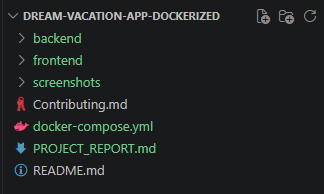
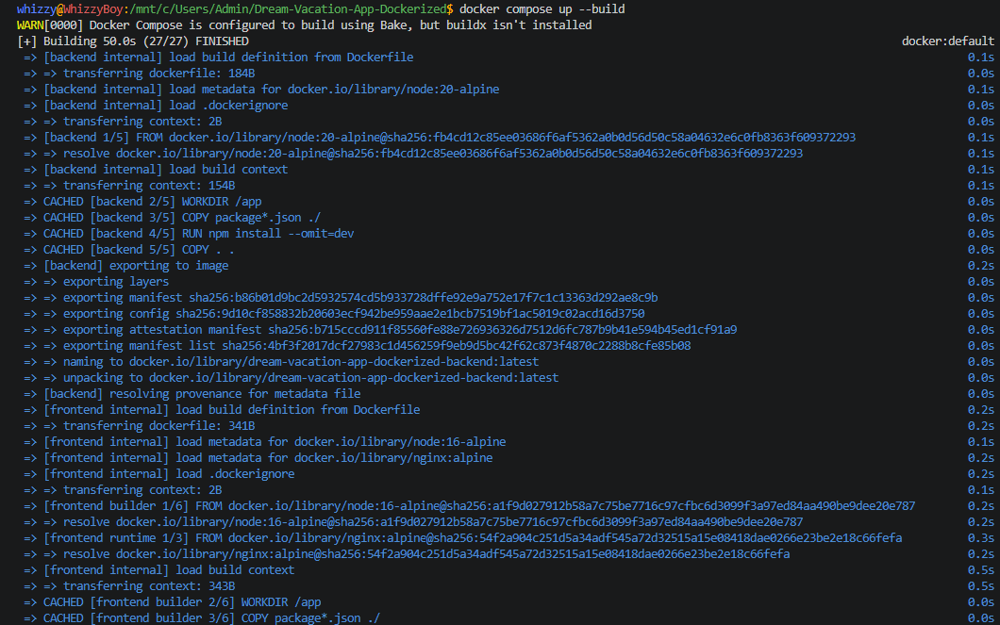
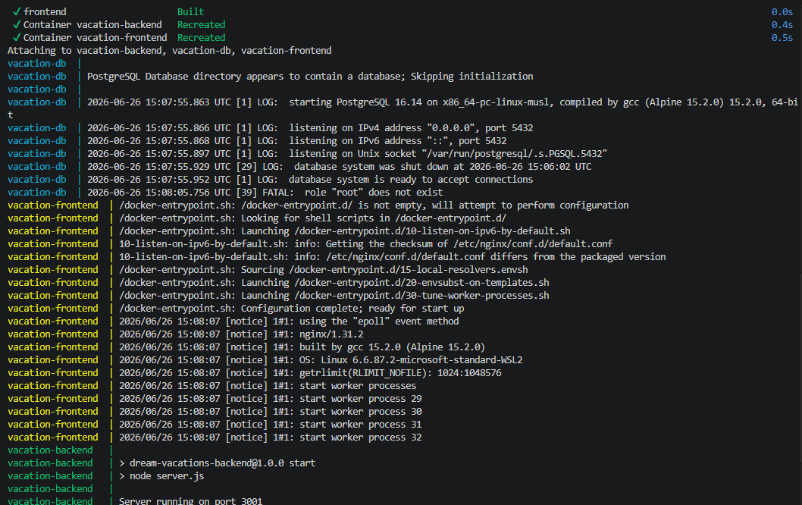
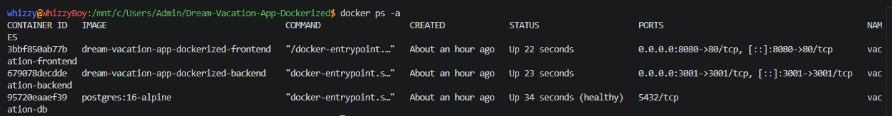
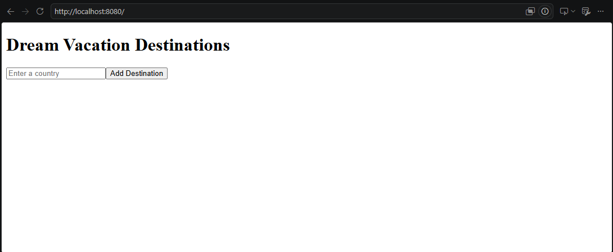
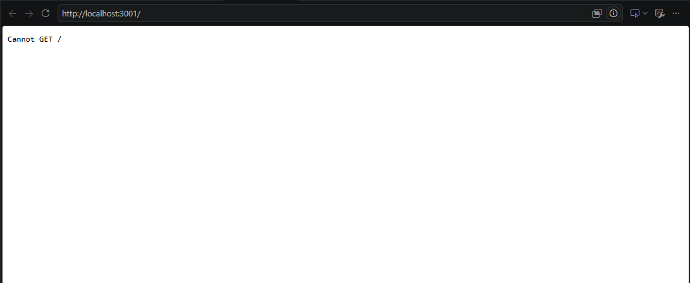

# Deployment Notes

## Implementation

This repository was containerized using Docker and Docker Compose.

The following tasks were completed:

- Created Dockerfiles for the frontend and backend services.
- Configured a multi-container application using Docker Compose.
- Added a PostgreSQL database service with a health check.
- Configured persistent database storage using Docker volumes.
- Configured Nginx to serve the React frontend.
- Connected the frontend, backend, and database through Docker networking.
- Successfully built and deployed the application using Docker Compose.

> **Note:** The backend application logic (`server.js`) was provided as part of the assignment and was not modified.

---

## Running the Application

Clone the repository and start the application with:

```bash
docker compose up --build
```

Once the containers are running, the application is available at:

- **Frontend:** http://localhost:8080
- **Backend API:** http://localhost:3001

---

## Screenshots

### Project Structure



### Docker Compose Build




### Running Containers



### Application Running



### Backend Running

